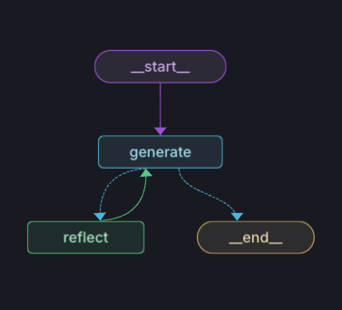

# Reflection Agent

## Introduction

Simple Reflection Agent where make twitter post better by few iterations.

### General information

- This project uses conda as an environment manager. The user must have Anaconda or Miniconda installed.
- This project uses git-hooks to check code quality when creating commits.

### Repository

- https://github.com/bchabros/reflection_agent.git

### Local env setup

#### 1. Conda

- Install conda (miniconda version): https://docs.conda.io/projects/conda/en/latest/user-guide/install/index.html
- Install conda (anaconda navigator version): https://anaconda.org/anaconda/conda
- Make sure conda directory (`C:\Users\<USER>\AppData\Local\miniconda3`) or (`C:\Users\<USER>\AppData\Local\conda`) is added to PATH environment variable in Windows
- Create conda environment from `env.yaml`: `conda env create -f env.yaml`
- Activate environment: `conda activate reflection_agent`

#### 2. .env file

- Create `.env` file in the project's root directory (based on .env-sample file). The content of `.env` is not stored in Git repository, because it contains secrets.

#### 3. PyCharm settings

- Edit Run/Debug configurations in PyCharm and make sure to select the correct `.env` file and conda environment
- In PyCharm choose `File -> Settings -> Python interpreter` and select `reflection_agent` environment

#### 4. Main File:

[main.py](main.py) - It's based on basic streamlit library so to run app you have to run command `streamlit run main.py`

#### 5. Reflection Agent Algorithm

Pipeline is simple Reflection Agent where in first step we send Twitter post and then we boost this twitter in few iterations.

#### 6. LangGraph Studio
In repo is [langgraph.json](langgraph.json) which is compatible with LangGraph Studio: https://blog.langchain.dev/langgraph-studio-the-first-agent-ide/

